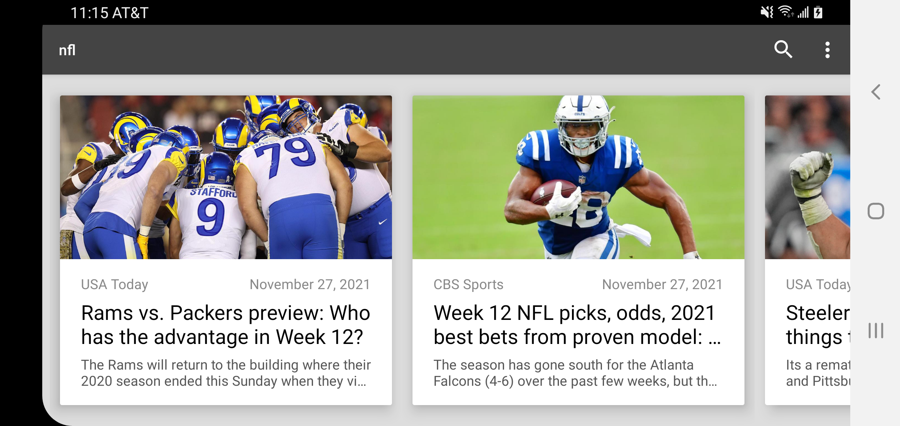
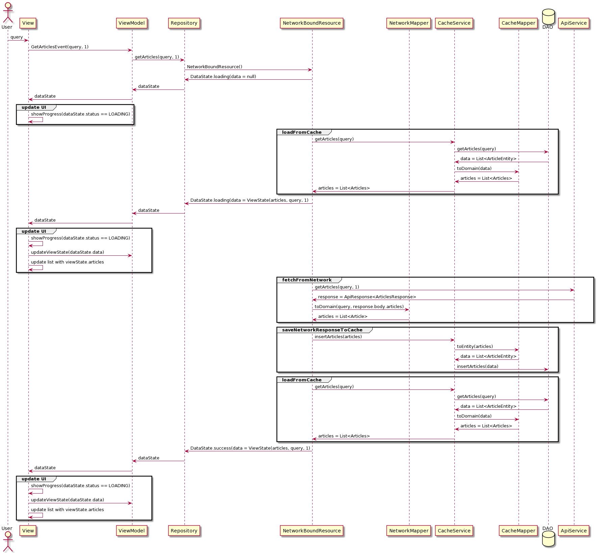

# Android sample illustrating MVVM and MVI application behavior patterns

   

## App requirements
- Allows searching news articles using the paginated API from https://newsapi.org
- Pull to refresh
- Data shall be cached for fast access

## Implementation
- The news articles are presented in a list view.
- The app stack is
   - OkHttp / Retrofit for the network model
   - Room / DAO for the cache model
   - Repository / ViewModel / LiveData for the MVVM / MVI architecture
   - Coroutines for data processing
   - Glide for image loading
   - RecyclerView / ViewHolder pattern for displaying the articles list
   - SearchManager / SearchRecentSuggestionsProvider for persisting search keywords
- The architecture will be MVVM and its MVI variant.
- **Cache is the source of truth**. Data fetched from the network is only used to update the cache.
- The API key is stored in local.properties as apiKey="your API key"
- The app supports both portrait and landscape without boiler plate code by virtue of LiveData
- The app supports dark mode based on the phone's settings

## MVVM Architecture
- Follows the vanilla implementation:
   - Repository: abstracts the data sources: cache (source of truth) and network (used to update the cache).
   - View Model: maintains the data that drives the UI and implements the business logic. Relies on the repository to access the data. Exposes the data wrapped in LiveData to the UI.
   - View: activities/fragments, observe the View Model LiveData and update the UI

- Additional implementation details:
   - Mappers are used to map between entity models and domain models. There are only 2 entity models: network and cache. Domain models are used in the upper layers: Repository / View Model / View.
   - Functionality is exposed via constructor-injected interfaces. This facilitates testing components in isolation where fake dependency implementations are injected. The following interfaces are implemented: api service, cache service, repository.

- The **initial MVVM implementation** has a few shortcomings:
   -  the network error handling is bubbled up to the UI via Exceptions caught and processed (displaying the error to the user) by the View Model.
   -  the data received from the Repository only contains articles data, leaving the responsibility on the View Model to manage the loading spinner and the error state.

- The **second MVVM implementation** improves the implementation as follows:
   - the data is wrapped in a **Resource** adding a message String and a status: success / error / loading. This relieves the responsibility on the upper layers (ViewModel) to manage the data state such as the loading state (and its associated progress indicator), the error state (and its error dialog), and finally the nominal success state. The Repository will first emit a Resource to indicate the loading state, later it will emit another Resource once the data is retrieved, and eventually a different Resource in case of an error.
   - the **cache is the source of truth** common business logic is abstracted into a **NetworkBoundResource** that executes the following flow for every Repository API call:
      - emits a **loading Resource with no data** to instruct the ViewModel to update the loading LiveData observed by the View so the latter can display the loading indicator
      - queries the cache and emits a **loading Resource with the cache data** so that app can display the cached data immediately
      - executes the network request
      - in case of network success
         - updates the cache
         - queries again the cache and emits a **success Resource with the updated cache data** so that app can display the updated cached data
      - in case of network failure emits an **error Resource** so that the app can display the error
   - The **NetworkBoundResource** allows the Repository to be very lean and only implements API specifics by implementing abstract methods defined by the NetworkBoundResource.

## MVI Architecture
The MVI architecture improves the implementation as follows:
- all user interactions are abstracted via a **StateEvent** sealed class. These events are sent from the View to the View Model when the user interacts with the app:
   - when the user performs a search the View sends the **GetArticlesEvent**
   - when the user pulls to refresh the View sends the **RefreshEvent**
   - when the user scrolls to the bottom of the articles list the View sends the **IncrementPageEvent**
   - all these events are received by the View Models and Repository APIs are called to fetch the data
 - all the View data is wrapped into a **ViewState**. Specifically the articles list View requires the following: the articles data, the search query string and the page index.
- all fetched data is wrapped in a **DataState** which wraps the View data alongside the loading state and the error message. This is similar to the **Resource** class from the MVVM architecture.
- within the **DataState** the error message and the articles data are each wrapped into a consumable **Event** as they are exposed to the View via LiveData and they should be consumed upon access. For example if the Airplane mode is set to ON, the View will receive and display an error message. If the phone changes orientations that error message will be displayed again (LiveData) unless wrapped into a consumable **Event**.

To summarize
- **StateEvents** are used to send user interactions events from the View to the View Model.
- the View Model handles the StateEvents by making appropriate calls to the data layer via the Repository.
- the Repository responds with a flow of **DataStates** that encapsulate the View state ( success / error / loading ) and the all-encompassing View data (wrapped in **ViewState**).

Uml sequence diagram for the user making a query search

Execution example:
- app starts OR user searches for "Top Headlines"
	- GetArticlesEvent(query=Top Headlines, page=1) **user interaction event**
	- DataState(status=LOADING, message=null, data=null) **loading**
	- DataState(status=LOADING, message=null, data=ArticleListViewState(articles=[], query=Top Headlines, page=1)) **empty cache hit, still loading state**
	- API call: http://newsapi.org/v2/everything?q=Top%20Headlines&page=1&pageSize=10&sortBy=publishedAt&language=en&apiKey= **loads page 1 from network, updates cache**
	- DataState(status=SUCCESS, message=null, data=ArticleListViewState(articles=[Article(1), Article(1726243711), Article(1528412622), Article(-995679586), Article(-1375563641), Article(270800907), Article(-2056362363), Article(538178404), Article(219357909), Article(1189165479), Article(1151014404)], query=Top Headlines, page=1)) **updated cache hit, 10 articles, success state**
- user scrolls to the bottom of the list
	- IncrementPageEvent **user interaction event**
	- DataState(status=LOADING, message=null, data=null) **loading**
	- DataState(status=LOADING, message=null, data=ArticleListViewState(articles=[Article(1726243711), Article(1528412622), Article(-995679586), Article(-1375563641), Article(270800907), Article(-2056362363), Article(538178404), Article(219357909), Article(1189165479), Article(1151014404)], query=Top Headlines, page=2)) **cache hit, 10 articles, still loading state**
	- API call: http://newsapi.org/v2/everything?q=Top%20Headlines&page=2&pageSize=10&sortBy=publishedAt&language=en&apiKey= **loads page 2 from network, updates cache**
	- DataState(status=SUCCESS, message=null, data=ArticleListViewState(articles=[Article(1726243711), Article(1528412622), Article(-995679586), Article(-1375563641), Article(270800907), Article(-2056362363), Article(538178404), Article(219357909), Article(1189165479), Article(1151014404), Article(-2120201611), Article(-904808611), Article(742014054), Article(1254831480), Article(-1881845964), Article(9912236), Article(-520627924), Article(-1962542157), Article(1107571009), Article(-1246901041)], query=Top Headlines, page=2)) **updated cache hit, 20 articles, success state**
- user pulls to refresh (empties the cache)
	- RefreshEvent **user interaction event**
	- DataState(status=LOADING, message=null, data=null) **loading**
	- DataState(status=LOADING, message=null, data=ArticleListViewState(articles=[], query=Top Headlines, page=1)) **empty cache hit, still loading state**
	- API call: http://newsapi.org/v2/everything?q=Top%20Headlines&page=1&pageSize=10&sortBy=publishedAt&language=en&apiKey= **loads page 1 from network, updates cache**
	- DataState(status=SUCCESS, message=null, data=ArticleListViewState(articles=[Article(1726243711), Article(1528412622), Article(-995679586), Article(-1375563641), Article(270800907), Article(-2056362363), Article(538178404), Article(219357909), Article(1189165479), Article(1151014404)], query=Top Headlines, page=1)) **updated cache hit, 10 articles, success state**
