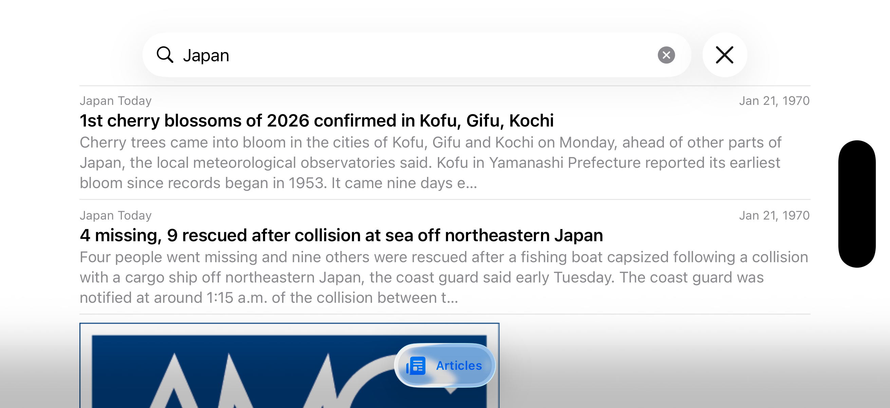

# News — iOS

iOS sample illustrating the MVVM architecture pattern built with **SwiftUI**.

## Setup
- Create your own News API key at https://newsapi.org and set it in `NewsApi.key`.
- Avoid committing your key by running:
  ```bash
  git update-index --assume-unchanged news/app/constants/NewsApi.swift
  ```
  To undo: `git update-index --no-assume-unchanged news/app/constants/NewsApi.swift`
- Run `pod install` to install dependencies, then open `news.xcworkspace`.

## Requirements
- Browse news articles fetched from the paginated API at https://newsapi.org
- Infinite scrolling (auto-loads next page when the user reaches the bottom)
- Pull to refresh
- Data is cached locally for fast access (cache is the source of truth)
- Dark mode support (follows system settings)
- Portrait and landscape support

## Screenshots


<br/>
<br/>


## Tech Stack

| Layer | Technology |
|-------|-----------|
| UI | SwiftUI |
| State management | `@Observable` (Swift 5.9+) |
| Local cache | GRDB (SQLite) |
| Networking | URLSession (`HttpClient`) |
| Dependency injection | Custom `InjectionProvider` |
| Unit tests | Swift Testing framework |

## MVVM Architecture

### Layers

- **View** (`ArticlesView`, `ArticleCardView`): SwiftUI views that observe the ViewModel via `@Observable`. The view triggers events (scroll, refresh) and reflects the ViewModel state — no business logic lives here.
- **ViewModel** (`ArticlesViewModel`): Marked `@Observable` and `@MainActor`. Maintains all UI state (`articles`, `showProgress`, `errorMessage`, `isScrollingFinished`) and delegates data access to the Repository.
- **Repository** (`DefaultRepository`): Abstracts the two data sources — local cache (source of truth) and remote network (used only to update the cache). Exposes data as `AsyncStream<Resource<[ArticleEntity]>>`.
- **Cache** (`DefaultNewsDatabase` via GRDB): Persistent SQLite database storing `ArticleEntity`, `QueryEntity`, and `QueryArticleEntity` records. Falls back to `SessionNewsDatabase` (in-memory) if the database file cannot be created.
- **Network** (`DefaultHttpClient`): Wraps `URLSession` and decodes JSON responses into typed models. All errors are mapped to `HttpError`.

### Dependency Injection

Dependencies are registered once at app startup via `DefaultInjections` and resolved through `InjectionProvider.byType(_:)`. Interfaces (`Repository`, `HttpClient`, `NewsDatabase`) are injected by type, making it easy to swap real implementations for fakes in tests.

```swift
// Registration (NewsApp.swift)
InjectionProvider.register(DefaultInjections())

// Resolution (ArticlesViewModel.swift)
init(repository: Repository = InjectionProvider.byType(Repository.self))
```

### Resource & NetworkBoundResource

All repository calls return `AsyncStream<Resource<T>>`. `Resource` is a Swift enum with three cases:

```swift
enum Resource<Item> {
    case loading(item: Item?)   // Emitted immediately with cached data (if any)
    case success(item: Item)    // Emitted after a successful network fetch + cache update
    case error(error: Error)    // Emitted on network or decoding failure
}
```

The common cache-first flow is implemented in `ResourceProvider.networkBoundResource(...)`:

1. Emit `.loading(nil)` — tells the ViewModel to show a progress indicator.
2. Load from cache → emit `.loading(cachedData)` — displays stale data instantly.
3. Decide whether a network fetch is needed (`shouldFetchFromNetwork`).
4. If yes:
   - Fetch from network.
   - Save to cache.
   - Reload from cache → emit `.success(freshData)`.
5. On any error → emit `.error(error)`.

This keeps the Repository lean; it only provides closures for each step.

### Infinite Scrolling & Pagination

`ArticlesView` appends a `ProgressBar` at the bottom of the list. When it becomes visible (`.onAppear`), `fetchArticles(refresh: false)` is called, incrementing the page and fetching the next batch. The ViewModel sets `isScrollingFinished = true` when the returned article list is identical to the current list (no new data).

### Pull to Refresh

SwiftUI's `.refreshable` modifier calls `fetchArticles(refresh: true)`, which resets the page to 1 and forces a network fetch regardless of cache state.

## Project Structure

```
news/
├── app/
│   ├── NewsApp.swift
│   ├── constants/
│   │   ├── DefaultInjections.swift
│   │   └── NewsApi.swift
│   ├── localization/
│   │   └── Localizable.xcstrings
│   ├── utils/
│   │   ├── dependencyInjection/
│   │   │   ├── Inject.swift
│   │   │   ├── InjectionProvider.swift
│   │   │   ├── InjectionType.swift
│   │   │   └── Injections.swift
│   │   └── extensions/
│   │       ├── Array+Comon.swift
│   │       ├── ArticleEntity+DateCreated.swift
│   │       └── String+Common.swift
│   └── views/
│       ├── ContentView.swift
│       ├── viewComponents/
│       └── articles/
│           ├── ArticleCardView.swift
│           ├── ArticlesToolbarModifier.swift
│           ├── ArticlesView.swift
│           ├── ProgressBar.swift
│           └── vm/
│               ├── ArticlesViewModel.swift
│               ├── ArticlesViewModelContract.swift
│               └── ArticlesViewModelPreview.swift
├── data/
│   ├── Article.swift
│   ├── ArticlesResponse.swift
│   ├── cache/
│   │   ├── ArticleEntityMapper.swift
│   │   ├── EntityMapper.swift
│   │   └── database/
│   │       ├── DefaultNewsDatabase.swift
│   │       └── NewsDatabase.swift
│   └── util/
└── network/
    ├── DefaultInternetService.swift
    ├── DefaultRepository.swift
    ├── InternetService.swift
    ├── NoResponse.swift
    ├── Repository.swift
    ├── ResourceProvider.swift
    └── api/
        ├── defaultHttp/
        │   ├── DefaultHttpClient.swift
        │   ├── DefaultHttpRouter.swift
        │   └── DefaultSessionDataDelegate.swift
        └── http/
            ├── DecoderFactory.swift
            ├── ErrorModel.swift
            ├── HttpClient+Common.swift
            ├── HttpClient.swift
            ├── HttpClientResponse.swift
            ├── HttpClientResponseRaw.swift
            ├── HttpError.swift
            ├── HttpMethod.swift
            ├── HttpRouter.swift
            ├── Resource.swift
            └── URLRequest+Common.swift

newsShared/
├── constants/
│   ├── PreviewConstants+ArticleEntities.swift
│   ├── PreviewConstants+Articles.swift
│   └── PreviewConstants.swift
└── stubs/
    ├── Article+Stub.swift
    ├── ArticleEntity+Stub.swift
    └── Stub.swift

newsTests/
├── ArticlesViewModelTest.swift
├── HttpClientTest.swift
├── RepositoryTests.swift
├── mocks/
│   ├── MockHttpClient.swift
│   ├── MockInternetService.swift
│   ├── MockNewsDatabase.swift
│   └── MockRepository.swift
└── utils/

newsUITests/
└── (UI tests files)
```

## Testing

Tests use **Swift Testing** (`@Test`, `#expect`) and hand-written mocks — no third-party mocking library is required.

- `MockRepository` exposes two `AsyncStream` properties (`articlesStream`, `articlesRefreshStream`) that tests set directly before calling the method under test.
- `MockHttpClient` exposes a `rawRequestHandler` closure to simulate network responses or errors.
- `AsyncStream+Common` provides a `collect()` helper that gathers all emitted values into an array, making stream assertions straightforward.

```swift
sut.articlesStream = AsyncStream { continuation in
    continuation.yield(.loading())
    continuation.yield(.success(item: ArticleEntity.samples))
    continuation.finish()
}
let result = await sut.getArticles(query: "Tech", page: 1).collect()
#expect(result.last == .success(item: ArticleEntity.samples))
```
